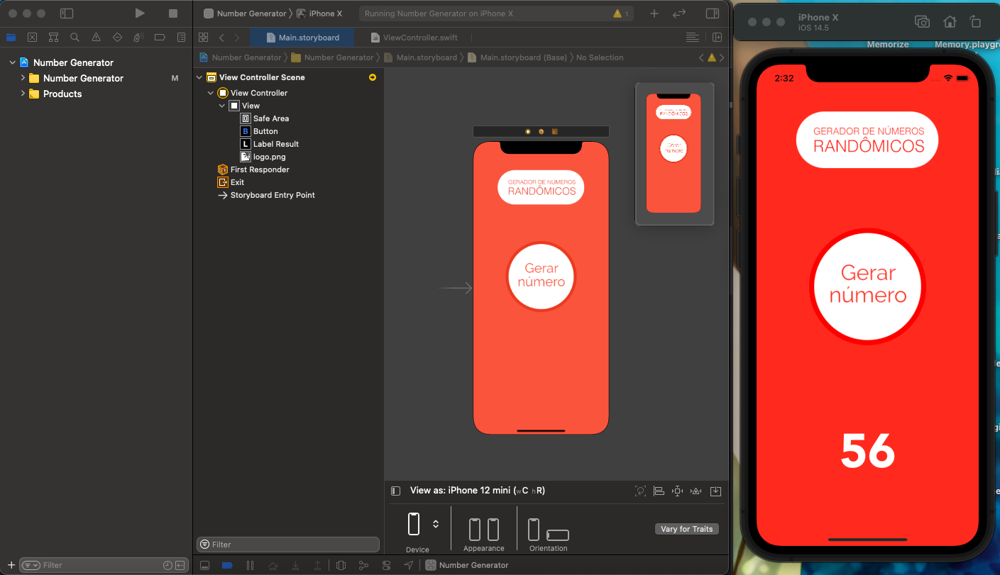

# Number Generator

## 📋 Descrição

Nesse repositório está o projeto que desenvolvi para aprender e fixar os conhecimentos em Swift usando o Storyboard. 

Number generator é um projeto bem simples cujo o proposito e através de um botão, gerar numeros aleatorios entre 0 e 100

=)

## 📲 ScreenShots

## 🖥️ Tecnologias

- Swift
- Storyboard

## 🎨 Projeto
*✓ Finalizado (sujeito a melhorias)*

##  📩 Avisos
*O Projeto esta setado para gerar numeros entre 0 e 100*
